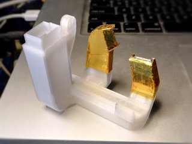

# FlashForge Creator Pro left single extruder fan duct
*Cooling duct for the left extruder of the FlashForge Creator Pro and similar 3D printers (formerly thing:2436915)*

### License
[Creative Commons - Attribution](https://creativecommons.org/licenses/by/4.0/)

### Attribution
This is a remix of my own [‘FlashForge Creator Pro front dual fan duct’](https://github.com/DrLex0/print3d-ffcp-dual-cooling-duct).

### Gallery

[🔎](images/duct1.jpg) [🔎](images/duct2.jpg) [🔎](images/duct3.jpg) [🔎](images/duct4.jpg) [🔎](images/simulation-tracer.png)

## Description and Instructions

This is the single-extrusion alternative to my [dual duct](https://github.com/DrLex0/print3d-ffcp-dual-cooling-duct). I only do a dual extrusion about once every 100 prints, and I figured it is a bit pointless to have the dual duct blow air at the inactive (and usually unscrewed) nozzle all the time. It makes more sense to also direct this air at the active nozzle. By blowing air from two directions, this design reduces the ‘shadow’ problem both the stock duct and my dual duct suffer from, and cools more equally from all sides. If you're only going to print with one extruder, this duct will give you the best quality. Of course this does not make the dual duct obsolete: you still need it to get proper cooling on dual extrusions.

Mind that the shadow problem is not completely eliminated. Overhangs at the rear and right will still be cooled less effectively because the air cannot reach their undersides. One way to work around this is to print extra walls behind such overhangs to reflect the airflow back towards them. In most cases this will be unnecessary however, but keep it in mind for those prints that need to be really perfect.
(Someday I might try to update the design to have opposite exhausts for symmetrical cooling but this will obviously require big changes.)

This duct unfortunately is not plug-and-play. You must read the **Using** section. If you don't, your prints will likely fail, you have been warned.

Quite a bit of time and effort went into designing this. If you want to show some appreciation, [there are some tipping options on my site](https://www.dr-lex.be/about/#contact).

This duct has not been merely designed in a wet-finger guessing way. It has been run through several dozens of iterations, the last of which were validated with computer simulations. See the ‘How I Designed This’ section for more details.

### Printing

There are two models. The ‘x1’ model has the exhausts 1 mm lower than the regular model. If you aligned your nozzles with [this tool](https://www.thingiverse.com/thing:1582720), you need the regular version. If you installed Micro Swiss all-metal hotends and followed their installation instructions to the letter, then your nozzles will be 1 mm lower and you need the ‘x1’ model. If you're unsure, you can check as follows what model you need. Bring the carriage forward so it is flush with the front edge of the print bed. Then raise the bed until it just touches the nozzle, as shown in the photo. Next, measure the distance between the bed and the bottom of the carriage. If this is close to 10 mm, you need the regular model. If it is closer to 11 mm, you need the x1 model. (Of course you could also just print both models and see which one works best.)

[🔎](images/ductalign.jpg)

As with the dual duct or any duct whatsoever, you must print this in a **heat-resistant material** because it is very close to the heater block, moreover this duct has even more material near the heated bed. Do *not* print it in PLA. I recommend **ABS** although even that may not be sufficiently heat-resistant on its own during ABS or PETG prints. If you are able to print in polycarbonate, it is probably the best option if you often print with the bed above 100°C or the extruders at 230°C or more. An ABS printed duct will do fine however if you add extra insulation (see *post-printing* section).

Same as for the dual duct: do not enable supports, they could block the inner passages. The model is designed such that it will print well without supports. I recommend enabling cooling while printing the top layer of the main vent and the upper tip of the left exhaust (for this purpose the stock duct should suffice).
Infill doesn't matter much if your slicer is configured to always print small areas solid. If unsure, set infill to 100% for the entire print.

### Post-Printing

**Preparing the duct for mounting**

You should ream the little hole next to the mounting screw hole with a 2 mm drill bit. Otherwise you'll probably have a hard time mounting the duct onto the carriage.

**Protecting the duct against heat**

Even if you printed the duct in ABS, it still is very close to the heater block and the exhausts *will* deform if the duct is exposed to high temperatures for more than just a few minutes while the fan is off or running at very low speed. If the exhausts deform, the duct will no longer work optimally. You should therefore consider applying some thermal insulation to the exhausts, especially if you print with ABS or PETG.

As shown in the photos, I use some NASA-style insulation that consists of a layer of self-adhesive aluminium foil, with a layer of kapton tape on top. To be really sure, I applied this twice at the tips of the exhausts. It is time-consuming to apply this but is well worth it because it has proven to be extremely effective. If you have only one of those materials, I believe a few layers of just aluminium or just kapton will also do the trick.

There are a few cases in which you might get away without insulation:
* If you're only going to print PLA or other filaments that do not require extruder temperatures above 210°C and no bed temperatures above 80°C.
* If you always enable the cooling fan at (near-)maximum speed. This will keep the duct itself cooled and it won't deform. However if you only enable the fan after the first few layers (as you should), then you still risk damaging the duct when printing something large because the duct will remain uncooled during those long first layers.
* If your heater blocks have much better thermal insulation than mine.

### Installing
A thin strip of rubber (like a piece of bicycle tire) under the little mounting tab can help to avoid that the duct vibrates and rattles.

If you have an older printer and yet have to install the blower fan, you may need to print the [fan mounting bracket](https://www.thingiverse.com/thing:2086927) first.

### Using
First of all if you're going to do a long print with the fan disabled entirely, remove the duct to avoid that it will deform, especially if you're printing at very high temperatures, e.g. polycarbonate. Even if you applied thermal insulation, you should still remove the duct if unused during long prints.

Next, very important: don't just print and try to use this duct, it unfortunately is not that simple. **This duct is almost unusable if you cannot control fan speed.** You risk getting very poor layer adhesion in the lower part of your print, and fast-printed parts like infill may detach already during printing. In other words, your print will fall apart. To avoid this, you must reduce fan speed in a specific manner. Unfortunately **fan speed cannot be controlled on an unmodified FFCP,** which I find the largest shortcoming of this printer by far. Modifications are required, below I explain how you can get variable fan speed after all.

Due to effects described below (see ‘Background info’ if you're interested), you must:
* only enable the fan after the second or third layer,
* start out with the fan running at no more than 20% speed,
* gradually increase fan speed over the course of the first few millimeters of the Z-axis until the desired maximum (in my case 50% is usually more than enough).

Being able to control fan speed is the only practical way to get optimal cooling with this duct (actually with any duct for that matter). Variable speed is also essential for getting good results with filaments like PETG, which require a tiny bit of cooling for best results. You may also be surprised to hear that I always enable the fan on ABS prints albeit at very low speed, which does improve quality without ruining layer adhesion. Also, after installing an all-metal hot-end with hardened steel nozzle, I noticed I need much less cooling which made it essential to be able to throttle the fan.

### How to obtain variable fan speed
Your software might make it seem as if you can vary the speed of the fan, but this is a *lie.* None of the printers that use the MightyBoard design like the FFCP and clones, can control fan speed without modifications. The MightyBoard can only toggle its EXTRA output on and off, hence ramping up the fan won't be possible.

Some options:
* Simplest is to install a [hardware PWM controller](https://www.thingiverse.com/thing:2095862) in between the printer motherboard and the cooling fan. This isn't complicated and the only (optional) permanent modification you need to make to your printer is to drill two tiny holes. You can use an analog controller like the one shown there, or a microcontroller like an Arduino with PWM capable output and a 24V MOSFET to drive the fan. This solution is still cumbersome because you will need to babysit every print at least during its first few layers to slowly ramp up the fan speed.
* Better is to use my [MightyVariableFan system](https://github.com/DrLex0/MightyVariableFan), which will result in fully automatic fan speed control that reacts to G-code fan speed commands with high accuracy. Installing it is more work than mounting a single circuit board, but once you've got it running you will never want to go back.
* Install a recent build of the Sailfish firmware that has the software PWM feature. Speed cannot be changed however during a print and it does not respond to speed arguments in the G-code, making it mostly useless. A pull request exists that allows to build a custom firmware which is able to respond to fan speed commands in G-code, but this can only work if you also compile a custom build of the GPX converter and somehow manage to squeeze Sailfish-compatible G-code with variable fan speeds out of your slicing software. And when you have done all this, the timing of the fan speed changes will still be awful.

**Possible workarounds that do not require a PWM controller**

If you don't want to do the effort to add PWM but still want to use this duct, there are some fallbacks that might avoid total disaster, although they are all inferior to varying the fan speed.

* Simplest is to just stick with the [dual duct](https://github.com/DrLex0/print3d-ffcp-dual-cooling-duct).
* Print much hotter, slowly, and in thin layers to reduce the risk of layer delamination.
* To counteract the typical extruder temperature undershoot when the fan activates at lower layers, you could boost extruder temperature by 10°C about 10 seconds before the fan will engage. In theory this should put the extruder is in its heating regime when the blast of cold air hits it, and the undershoot should be reduced or eliminated. You may then gradually reduce extruder temperature again until the print is about 4 mm tall, but you should keep the temperature higher than when printing without fan. This is obviously cumbersome because you will either have to manually fiddle with the LCD menu to do this, or write a post-processing script to insert extra M104 commands in your G-code at the right places.
* Make a hole in the side of the duct to lower the exhaust pressure. You could use tape to vary the size of this hole hence vary airflow in a clumsy manner. Of course this doesn't avoid the undershoot problem and trying to vary the airflow during a print will be challenging to say the least.

## How I Designed This

### SimScale / OpenFOAM
I considered simulating the duct in OpenFOAM but its learning curve is a bit too steep for something I will only be using once or twice. Therefore I first tried the same trial-and-error methods as for the dual duct. These however proved ineffective: the two interacting airflows made the windmill unusable; blowing onto a water surface or a layer of dry sand was also pointless because these methods constrain the test to a 2D surface. (By the way, be extremely careful if you would ever cover the glass bed in your printer with sand. Due to static charge build-up, the sand is likely to jump upwards at the moment you remove the glass plate. It is a very cool physics demonstration but getting the sand out of all the nooks and crannies of your printer is not very cool.)

In the end I did simulate the duct using [SimScale](https://www.simscale.com/), which offers a web interface on top of OpenFOAM for CFD simulations, so this eliminates most of the learning curve. Moreover it is entirely free for public community projects (with a simulation time budget of 3000 hours). You can find the public project [here](https://www.simscale.com/projects/DrLex/ffcp_left_extruder_cooling_duct/).
I ended up performing some 15 different simulations. I couldn't imagine printing and manually testing all those prototypes, so the simulations proved invaluable. I did have some problems getting the STL model imported but in the end I found out how to properly do it, and I can conclude that SimScale is really great.

[🔎](images/simulation-flow-nozzle.png)

*Airflow velocity around the tip of the nozzle. It is impossible to get a perfectly uniform flow field with only two exhausts, but this is about the best I could get within the constraints of this design.*

[🔎](images/simulation-flow-exhausts.png)

*Flow in the exhausts. Getting this well-balanced was not trivial.*

[🔎](images/simulation-flow-ex-left.png) [🔎](images/simulation-flow-ex-right.png)

*Flow cross-sections of the left and right exhausts.*

### Validation

The following photos show a comparison of my 55° [mushroom test](https://www.thingiverse.com/thing:2005832) on a PLA print between this duct, the v6 dual duct, and the stock duct. The result from the stock duct looks more decent than what I expected from watching it being printed: it was curling up so badly at times that I feared I would need to abort the print. Somehow the upper layers managed to push down the curls again, but it still looks ugly. Even despite the fact that this was tested with the first version of this new duct which was not anywhere as good as the latest version, the result shows almost no deformations and it has a near-flat top surface. (Note: you won't be able to get this kind of result with the stock nozzles, especially not if they have been worn out. This was printed with a more pointy Micro Swiss hardened steel nozzle which allows to print steeper overhangs than a nozzle with a flat underside.)

[🔎](images/comparison1.jpg) [🔎](images/comparison2.jpg)

## Background info: why is throttling the fan necessary?
There are two things at play here. First, the PID controller implementation in the Sailfish firmware is very bad at reacting to temperature drops. The reaction is way too slow therefore if something causes the extruder temperature to suddenly drop, there will be a severe temperature undershoot and part of the print will be printed too cold; layer adhesion will be compromised.

Second, during the first layers of the print, both the extruder and the duct are very close to the bed. This causes the air to ‘bounce,’ forcing it between the bed and heater block, greatly increasing overall airflow. The air hitting the heater block causes the extruder to lose heat, which triggers the PID undershoot problem. Moreover even if the undershoot would not occur, the material would still get cooled much harder than expected. All ducts suffer from this problem, which is why many poorly designed ducts (like the stock duct) work decently during the lower part of the print but do nearly nothing higher up. My duct is designed to work well at all times, which unfortunately causes it to work too well during the lower layers…

Therefore the fan must be started slowly during the lower layers to avoid the undershoot. Its speed must also be kept lower than usual during approximately the lower ≈3 mm of the print, because that's the region where the ‘bounce’ effect remains significant.

The severity of these issues will depend on your printer model and hot-end type. If you're lucky, you don't need to take countermeasures. In my case for instance, the problems only became significant after installing an all-metal hot-end with hardened steel nozzle.

## Will there be a version of this duct for the right extruder?

**No,** because:

1. The left nozzle is closest to the fan, making it much easier to design a duct with two exhausts blowing at it. I don't see any practical way to make a similar configuration for the right nozzle, not even if the left heater block would be removed. The second exhaust would need to make a wide curve around the back, making it large, heavy, and very difficult to print.
2. If you mostly print with one extruder and want to remove the heavy unused stepper motor to reduce ringing artifacts on single-nozzle extrusions, it is way easier to remove and reinstall the right stepper. (You do need to put [something](https://www.thingiverse.com/thing:2474664) in place to trigger the X endstop.)

## Updates
### 2017/07/16: v1
First version.

### 2017/07/26: v2
I noticed that the first version blew way too much air forward. I did most of my tests with the duct in free air, and neglected the fact that when mounted, the airflow would be inclined to get sucked against nearby structures. This did happen and it caused the heater and nozzle to struggle to maintain their temperature. This version improves upon this with a funky new exhaust design, and should also better aim its airflow in the horizontal plane.

**Small update 2017/08/05: v2b**
This is the same design but with a few minor changes that should make it slightly more robust, and also easier to mount with less risk of it cracking.

### 2017/10/21: v3
Almost a complete redesign, the result of performing CFD simulations in SimScale (OpenFOAM). The flows have been balanced and the dead zones have been eliminated. This duct is pretty much guaranteed to be very good. A nice side effect of the optimizations is that the duct is smaller and easier to mount.

## Tags
`baffle`, `cfm`, `cooling`, `cooling_duct`, `duct`, `fan_duct`, `FFCP`, `FFCPRo`, `flashforge`, `FlashForge_Dreamer`, `OpenFOAM`, `SimScale`, `simulation`, `upgrade`
